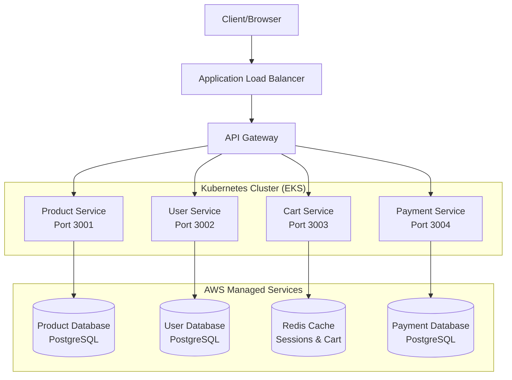

# E-Commerce Microservices Platform

A scalable e-commerce platform built with Node.js microservices architecture, containerized with Docker, and designed for deployment on AWS EKS (Kubernetes).

## 🏗️ Architecture Overview

This project demonstrates a modern microservices architecture with the following services:



### Service Responsibilities:
- **Product Service** (Port 3001) - Manages product catalog, inventory, and search
- **User Service** (Port 3002) - Handles user authentication, profiles, and account management
- **Cart Service** (Port 3003) - Manages shopping cart operations and session data
- **Payment Service** (Port 3004) - Processes payments and transaction history

## 🚀 Technologies Used

- **Backend**: Node.js, Express.js
- **Containerization**: Docker, Docker Compose
- **Cloud Platform**: AWS (EKS, RDS, ElastiCache)
- **Infrastructure**: Terraform (Infrastructure as Code)
- **Orchestration**: Kubernetes
- **Version Control**: Git, GitHub

## 📋 Prerequisites

Before running this project, ensure you have the following installed:

- [Node.js](https://nodejs.org/) (v18 or higher)
- [Docker](https://docs.docker.com/get-docker/)
- [Docker Compose](https://docs.docker.com/compose/install/)
- [Git](https://git-scm.com/)

## 🛠️ Installation & Setup

### 1. Clone the Repository
```bash
git clone https://github.com/yourusername/aws-k8s-ecommerce-app.git
cd aws-k8s-ecommerce-app
```

### 2. Run with Docker Compose (Recommended)
```bash
# Start all services
docker-compose up

# Run in background
docker-compose up -d

# Stop all services
docker-compose down
```

### 3. Run Individual Services (Development)
```bash
# Product Service
cd services/product-service
npm install
npm start

# User Service
cd services/user-service
npm install
npm start

# Cart Service
cd services/cart-service
npm install
npm start

# Payment Service
cd services/payment-service
npm install
npm start
```

## 🧪 Testing the APIs

Once the services are running, you can test the following endpoints:

### Product Service (Port 3001)
```bash
# Get all products
GET http://localhost:3001/products

# Get product by ID
GET http://localhost:3001/products/1
```

### User Service (Port 3002)
```bash
# Get all users
GET http://localhost:3002/users
```

### Cart Service (Port 3003)
```bash
# Get user's cart
GET http://localhost:3003/cart/1
```

### Payment Service (Port 3004)
```bash
# Get user's payment history
GET http://localhost:3004/payments/1
```

## 📁 Project Structure

```
aws-k8s-ecommerce-app/
├── README.md
├── docker-compose.yml
├── services/
│   ├── product-service/
│   │   ├── app.js
│   │   ├── package.json
│   │   └── Dockerfile
│   ├── user-service/
│   │   ├── app.js
│   │   ├── package.json
│   │   └── Dockerfile
│   ├── cart-service/
│   │   ├── app.js
│   │   ├── package.json
│   │   └── Dockerfile
│   └── payment-service/
│       ├── app.js
│       ├── package.json
│       └── Dockerfile
├── infrastructure/          # (Coming Soon)
│   └── terraform/
└── kubernetes/             # (Coming Soon)
    ├── deployments/
    ├── services/
    └── ingress/
```

## 🔄 API Endpoints

| Service | Method | Endpoint | Description |
|---------|--------|----------|-------------|
| Product | GET | `/products` | Get all products |
| Product | GET | `/products/:id` | Get product by ID |
| Product | POST | `/products` | Create new product |
| Product | PUT | `/products/:id` | Update product |
| Product | DELETE | `/products/:id` | Delete product |
| User | GET | `/users` | Get all users |
| Cart | GET | `/cart/:userId` | Get user's cart |
| Payment | GET | `/payments/:userId` | Get user's payments |
| Payment | POST | `/payments` | Process payment |

## 🐳 Docker Images

Each microservice is containerized with its own Dockerfile:

```bash
# Build individual service
docker build -t product-service ./services/product-service

# Build all services
docker-compose build
```

## ☁️ AWS Deployment (Planned)

This project is designed for deployment on AWS using:

- **EKS (Elastic Kubernetes Service)** - Container orchestration
- **RDS PostgreSQL** - Primary database
- **ElastiCache Redis** - Caching and session storage
- **Application Load Balancer** - Traffic distribution
- **CloudWatch** - Monitoring and logging
- **Terraform** - Infrastructure as Code

## 🚦 Development Roadmap

- [x] Basic microservices implementation
- [x] Docker containerization
- [x] Docker Compose setup
- [ ] Database integration (PostgreSQL, Redis)
- [ ] Kubernetes manifests
- [ ] AWS EKS deployment
- [ ] CI/CD pipeline with AWS CodePipeline
- [ ] Monitoring and logging setup
- [ ] Security implementation (JWT, SSL/TLS)
- [ ] API Gateway integration
- [ ] Auto-scaling configuration

## 🤝 Contributing

1. Fork the repository
2. Create a feature branch (`git checkout -b feature/AmazingFeature`)
3. Commit your changes (`git commit -m 'Add some AmazingFeature'`)
4. Push to the branch (`git push origin feature/AmazingFeature`)
5. Open a Pull Request

## 📝 License

This project is licensed under the MIT License - see the [LICENSE](LICENSE) file for details.

## 👨‍💻 Author

**Your Name**
- GitHub: [credchampion] (https://github.com/credchampion)
- LinkedIn: [adeoyeologunmeta-724b57218] (https://linkedin.com/in/adeoyeologunmeta-724b57218)
- Email: adeoyeologunmeta@gmail.com

## 🙏 Acknowledgments

- Built as part of learning modern DevOps and cloud-native development
- Inspired by real-world e-commerce architecture patterns
- Thanks to the open-source community for the amazing tools and libraries

---

⭐ **Star this repository if you found it helpful!**
